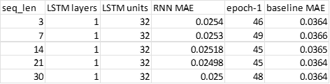
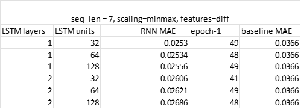
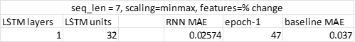
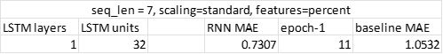
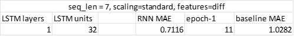

# forecasting-SPY
Forecasting future behavior of SPY with LSTM-based RNNs.

## Objective
Predicting the future price of a security is a ubiquitous and fundamental endeavor in financial fields, in which trades and other actions are often taken on the basis of how the market is believed to evolve in the future. The rewards are obvious – windfall profits potentially await those whose predictions significantly outpace those of a coin toss. So too are the risks posed by poor predictive power. 

With the rise of machine learning, neural network-based approaches have been applied to time series forecasting. More specifically, recurrent neural network (RNN) architectures incorporating long short-term memory (LSTM) are utilized in time series forecasting for their ability to identify patterns across sequences of data in time. 

This repository seeks to implement LSTM-based neural networks to forecast future security behavior. The specific security chosen is the SPDR S&P 500 trust exchange-traded fund (ETF), whose ticker is ‘SPY’. SPY is chosen for its low volatility relative to other securities and for its potential amenability to prediction; as SPY indexes the overall S&P 500 stock market, it seems reasonable that its future behavior may be more easily forecastable than that of an individual security, such as a single holding in SPY. 

This repository is not intended or designed for forecasting at production scale, but instead to lay the foundation for a forecasting model and explore key decisions that must be made in building such a model.

## Feature Set
### Securities
In addition to price data for SPY, price data for two other securities are obtained to predict the future closing price - or "close", that is, the final price of a security at the conclusion of a particular trading period - of SPY. These securities are:

-	USDX/DXY: known as the “Dixie”, an index of the value of the US dollar relative to various foreign currencies
-	VIX: known as the “fear index”, a CBOE index of the stock market’s expected volatility 

Like SPY, these securities are correlated with the overall market and as such were selected for use in forecasting SPY. A more thorough search for securities and other features that provide the most predictive power in forecasting SPY was not the focus of this repository, which places a greater emphasis on data processing, feature engineering, and network architecture. 

Prices in 2-minute intervals are obtained for each security - i.e., successive prices each separated from adjacent prices by 2 minutes.

### Periodic Features
A typical aspect of time series forecasting, where data exhibits periodicity or seasonality, is the creation of features that provide information regarding such periodicity/seasonality to a model.  A common method of creating this type of feature is to pass some measure of time through sine and cosine functions.  Being periodic and cyclical, sine and cosine functions can provide information regarding periodicity/seasonality to a model. In contrast, “raw” measures of time, such as datetime or timestamps, monotonically increase and do not indicate such information. 

In this repository, prices for the aforementioned securities are obtained in `Pandas.DataFrame` format, each associated with a corresponding datetime. Datetimes are converted to timestamps via `pd.Timestamp.timestamp()`, and passed through sine/cosine functions to create periodic features. 

The distributions exhibited by such periodic features are highly affected by the period of the sine/cosine function.  Assuming a periodic sine feature is computed via the following formulation:

> y(t) = sin(2πft)

The period can be expressed in terms of the frequency f as:

> T = 1/f
 
Given this effect, distributions of the periodic features were examined for different periods to select periods suitable for the dataset, which consists of prices at 2-minute intervals. A first period was selected as the number of seconds per hour (3600) to capture shorter-term periodicity, while a second period was selected as the number of seconds per 2.5 days to capture longer-term periodicity. Other techniques such as Fourier decomposition (supported natively in Tensorflow with `tf.signal.rfft`) can be used to identify frequency components in a time series.

## Data Collection
Free, public APIs for obtaining securities data are somewhat limited in their availability and functionality. A previously popular API for accessing data from Yahoo! Finance – provided by Yahoo itself – appears to be currently unavailable. However, a publicly available Python package named “yfinance” [accessible from Github](https://github.com/ranaroussi/yfinance) provides access to Yahoo! Finance data.

Although yfinance provides high-granularity securities data (up to 1-minute observations), access to 2-minute data is limited to the last 60 days. Even still, yfinance has a tendency to return a smaller range of data than requested. These factors limit the overall volume of training data that can be obtained, which in turn constrains model learning and performance. Data collection was not the focus of this repository but would likely pay great dividends if expanded. 

2-minute data for the aforementioned securities is obtained in `get_df.py` via `yf.download()`, and includes data outside of normal trading hours by setting `prepost=True`. Data for each security is downloaded individually and then joined into a common Pandas DataFrame via `df.join()`. Rows containing NaN are dropped via `df.dropna()`, and the resultant DataFrame is saved to a .csv file via `df.to_csv()`.

## Data Processing
### Time 
While the vast majority of observations are separated in time by 2 minutes, a small subset of observations exhibit a greater time delta. A ‘time_delta’ column is computed for each row by first converting the ‘Datetime’ column, consisting of datetimes of string type, into datetimes of Timestamp type, and computing the ‘time_delta’ column as the difference between the ‘Datetime’ column and the ‘Datetime’ column shifted forward by one row (via `df.shift(periods=1)`). 

The desired 'target' time delta – 2 minutes – is converted from a string into a Timedelta via `pd.Timedelta()`, and rows exhibiting time deltas other than 2 minutes are filtered out of the DataFrame via ` df[df['time_delta'] == delta] `. 

The absence of duplicate datetimes is confirmed by setting df’s index to ‘Datetime’ (`df = df.set_index('Datetime')`) and calling `df.index.has_duplicates`.

### Feature Transformation
The following feature transformations were explored, alone and in combination with exploring different types of feature scaling described below:

-	Converting each row into its percent change relative to the prior row via `df.pct_change()`
-	Converting each row into its arithmetic difference relative to the prior row via `df.diff()`
-	Converting each row into a logarithmic representation via `np.log()`

Such feature transformations can serve two purposes: (1) along with feature scaling, compressing feature values into narrower ranges more suited to neural networks, and (2) provide a more sensible target variable for a model to predict than the raw closing price of a security. 

As the periodic features are already bound within the interval [0, 1], and transforming such features into a measure of difference from a prior observation may obscure the time signal provided by these features, feature transformation is not applied to the periodic features but instead only to the securities features.

### Feature Scaling
Two types of feature scaling were explored: 

-	Standardization, by way of scikit-learn’s `StandardScaler()`
-	Minmax scaling, by way of scikit-learn’s `MinMaxScaler()`

Feature scaling is applied to all features, including securities and periodic features. 

### Transformation and Scaling Results
In examining feature distributions after transformation and scaling – through descriptive statistics via `df.describe()` and violin plots provided by seaborn’s `sns.violinplot()` - undesirably long tails were observed in the securities features’ distributions when using standardization in combination with percent change or difference transformations. Superior results were observed using minmax scaling in combination with percent change or difference transformations, although the majority of securities features’ values appears tightly clustered around specific values. 

Desirable results are observed with either standardization or minmax scaling in combination with logarithmic feature transformations, but as noted above, percent change or difference transformations that capture relative change in time may produce better target variables than logarithmic transformations of price.

## Windows/Sequence Generation
As is typical in time series forecasting, sequences of multiple, successive observations (rows in a DataFrame), are built and supplied to a model that makes predictions based on those multiple, successive observations, which are referred to as windows or sequences. 

Here, sequences are built via the `WindowGenerator` class, available from [Tensorflow’s time series tutorial]( https://www.tensorflow.org/tutorials/structured_data/time_series).  

The choice of sequence length is clearly a key decision in any time series forecast, affecting both the potential predictive power of a model and the overall volume of data available to the model in training. Here, a sequence length of 7 is chosen – that is, each sequence includes 7 successive observations in time, with each observation including a respective value for each feature (SPY price, DXY price, VIX price, hour_sin, hour_cos, 2.5_days_sin, 2.5_days_cos).  

Sequence length was not the focus of this repository; instead, a sequence length of 7 was chosen as being a reasonable “middle ground” likely to capture time-sequential patterns with predictive power. Nevertheless, a brief study of the use of different sequence lengths was performed as summarized in the following table:

Sequence lengths of 3, 7, 14, 21, and 30 were provided as input to an RNN consisting of 1 LSTM layer and 32 units, and to a baseline model, both described below. As seen in the table, only small variations in mean absolute error (MAE) were observed when varying sequence length. As described in further detail below, it is likely there is simply not enough data to draw meaningful conclusions from about the effects of varying sequence length. The analysis is also limited in its use of one, topologically-simple RNN. 

## Models
As noted above, this repository investigates forecasting with an LSTM-based RNN. Various topologies are explored, and results are compared to a baseline model. In particular, the price of SPY, or a quantity derived therefrom, is predicted one time step (two minutes) in the future.

### Baseline Model
[Tensorflow’s time series tutorial]( https://www.tensorflow.org/tutorials/structured_data/time_series) provides a `Baseline` class with which a baseline level of performance can be established for comparison to the performance of various RNN models. `Baseline` simply returns the current target variable – SPY price or derivative thereof – as the prediction. 

### RNNs
Various LSTM-based RNNs are investigated for their performance against the baseline model. RNNs used here differ in their number of LSTM layers and the number of LSTM units in each LSTM layers.  Generally, less complex RNNs with lower numbers of parameters are likely to perform better due to the relatively small size of the data set and smaller sequence length.  All RNNs used employ dropout and batch normalization after each LSTM layer. Model performance is evaluated based on MAE. Models were trained for 50 epochs.

Different RNN topologies were first investigated using minmax scaling and difference feature transformations, as summarized in the following table:

 

Best MAE is observed for an RNN with 1 LSTM layer and 32 LSTM units, with the second-best MAE being very similar in value for an RNN with 1 LSTM layer and 64 LSTM units. 

Further testing was performed to observe the effects on performance by using different types of feature scaling and performance, as summarized in the following tables:

 

 

 

 

As seen from the above, minmax scaling appears amenable to percent change feature transformation, while standardization results in poor performance with percent change and difference feature transformations.  A more reasonable MAE is achieved when pairing standardization with logarithmic feature transformations.

To the extent that the comparisons using RNNs consisting of 1 LSTM layer and 32 LSTM units are meaningful, best performance is achieved using minmax scaling with difference feature transformations.

## Scripts
Various scripts are provided for data acquisition, data processing, sequence generation, and model training. 

### get_df.py
This script utilizes `yfinance` to obtain prices for specified securities – by default, SPY, DXY, and VIX.  A singular Pandas DataFrame comprising all obtained data, sans rows containing NaN, is returned and saved to a local .csv file.  The date range in which securities data is obtained can be modified with the `start` and `end` arguments in `yf.download()`. Data granularity can be selected with the `interval` argument, and whether data outside of normal trading hours is obtained can be selected with the `prepost` argument.

### utils.py
This script implements the `WindowGenerator` class for generating sequences, and the `Baseline` class for instantiating a baseline model against which RNN performance can be evaluated. `WindowGenerator` provides class methods for generating train (`window.train()`) and validation (`window.val()`) sets comprising sequences.  Its `__init__()` method includes the following arguments:

-	input_width: length of input sequence used to predict target label;	for a sequence of length 7, input_width=7
-	label_width: length of predicted output sequence;	for predicting a single target, label_width=1.
-	shift: temporal offset between target label index and end of input sequence; for predicting a target one time step after the end of an input sequence, shift=1.
-	label_columns: names of target label(s) to predict; for predicting SPY close or derivative, label_columns=[‘SPY_close’]

### script.py
This script loads a Pandas DataFrame from the .csv file created by get_df.py, creates periodic features, processes data, trains an RNN model, and evaluates the model against the baseline model. The following methods are included:

-	`preprocess_df()`: performs data preprocessing and outputs train and validation data sets according to the following arguments:
	- `scaling`: ‘standard’ for standardization, ‘minmax’ for minmax scaling, or None for no scaling.
	- `features`: ‘percent’ for percent change feature transformation, ‘diff’ for difference feature transformation, or ‘raw’ for no feature transformation  
	- `split`: ratio with which to split dataset into train and validation sets  
   
-	`plot_features()`: takes in a DataFrame and renders a violin plot of features via seaborn 
-	`compile_and_fit()`: trains input RNN model on generated sequences

## Limitations and Future Development
This repository represents a foray into time series forecasting and is not intended to predict the behavior of securities at production scale. As such, there are many avenues – some explored, others not – to improving model performance.

First, it is likely there is simply not enough data for models to learn from and obtain meaningful predictive power. This is due to the limitations of Yahoo!’s APIs and yfinance. Other paid APIs exist that can provide far greater volumes of data with less constraints. Future development should prioritize collecting much more data.

Future development should also study which features – securities or otherwise – provide the best predictive performance for forecasting SPY. Abundant securities data is readily available via paid APIs as mentioned above.

Another factor limiting data volume is the fact that SPY, DXY, and VIX operate on different exchanges (NYSE v. CBOE) and as such produce data in different time ranges. This requires dropping rows with NaNs due to such temporal misalignment – in turn limiting data volume – or implementing a more complex technique to handle temporal misalignment. Initially, TNX was a fourth security used as a feature but was dropped due to having high temporal misalignment with the other securities. Future development should investigate how to address this issue, including whether simply having greater data volumes is sufficient even in the presence of temporal misalignment.

As results can vary greatly with sequence length, future development should also investigate varying this parameter.  Ideally, different sequence lengths can be incorporated to allow models to identify shorter-term and longer-term patterns, whether a single model is configured to accept variable sequence lengths (by using padding, for example) or an ensemble of models is used that includes at least one model for each sequence length in a set of selected sequence lengths.

At production scales, an ensemble of models would likely be used to forecast SPY and other securities. These not only could take in securities data and periodic signals, but also perform sentiment analysis and other tasks not related to time series forecasting. 

Finally, RNNs – whether based on LSTMs or otherwise – are not the end-all-be-all of time series forecasting and can suffer from fundamental limitations that constrain predictive capability. A great variety of techniques, including those based on machine learning and those not, have been successfully deployed for predicting future behavior, such as ARIMA, bootstrapping, and bagging.
